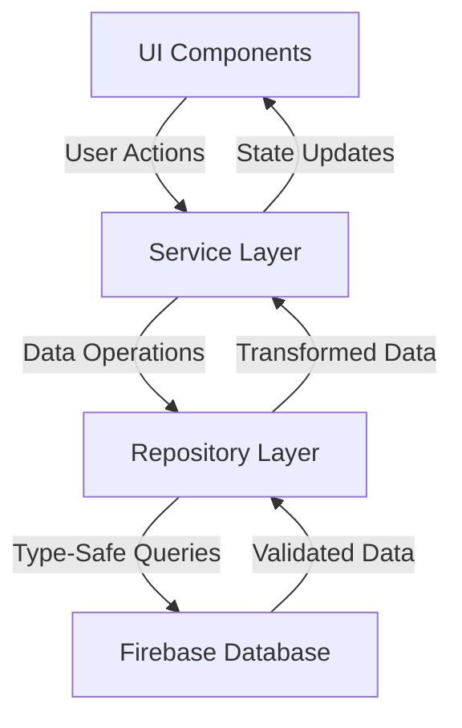
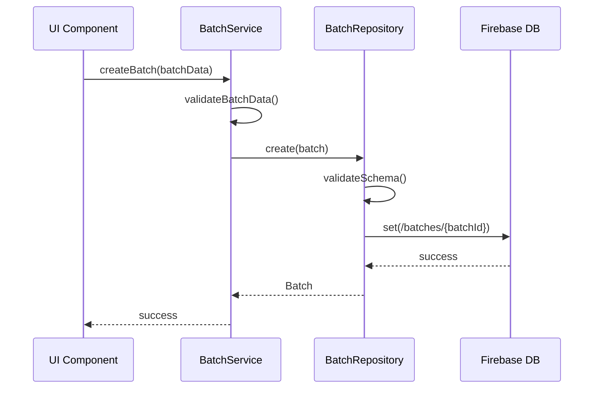
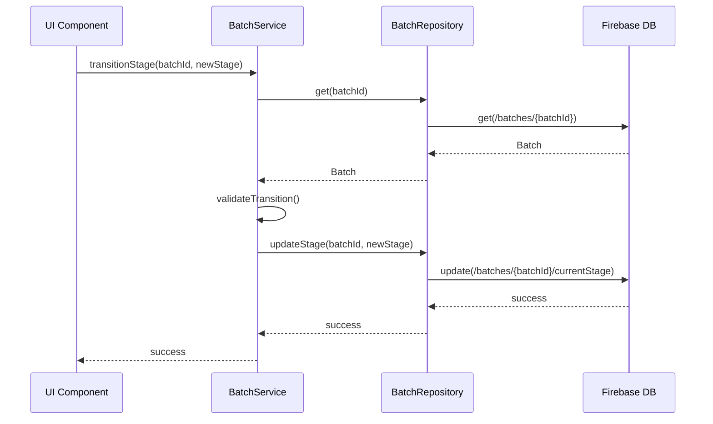
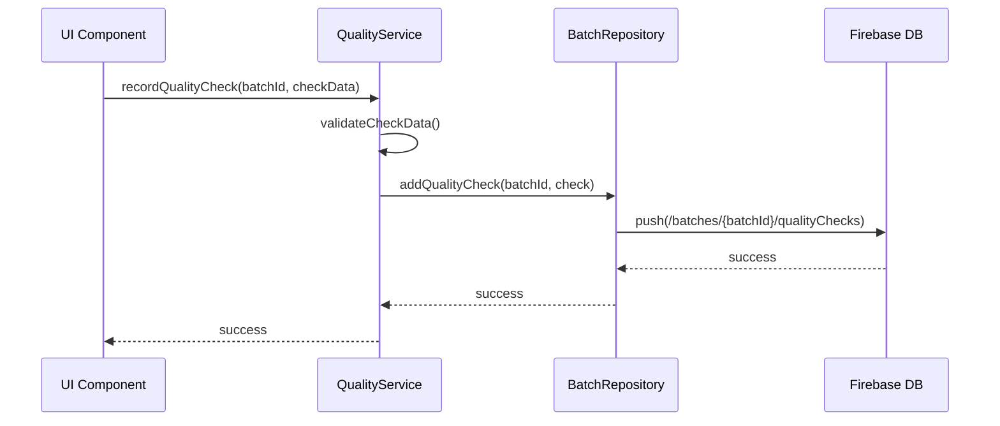

# Kombucha Tracker Architecture

## System Overview

The Kombucha Tracker is a professional-grade web application built with React, TypeScript, and Firebase. It follows a clean architecture pattern with clear separation of concerns and type-safe data handling.

### Tech Stack
- **Frontend**: React + Vite + TypeScript
- **UI Framework**: Tailwind CSS (mobile-first)
- **State Management**: Zustand + Firebase
- **Authentication**: Firebase Auth
- **Data Storage**: Firebase Realtime Database
- **Validation**: Zod
- **Deployment**: GitHub Pages

## Architecture Layers

### 1. Presentation Layer
- React components for UI rendering
- Tailwind CSS for styling
- Zustand for local state management
- Protected routes for authentication

### 2. Service Layer
- Business logic implementation
- Data transformation and validation
- Integration with Firebase services
- Error handling and logging

### 3. Repository Layer
- Data access abstraction
- Type-safe database operations
- Schema validation
- CRUD operations

### 4. Data Layer
- Firebase Realtime Database
- Schema definitions (Zod)
- Type definitions
- Data validation rules

## Data Flow



## Common Operations

### 1. Batch Creation


### 2. Stage Transition


### 3. Quality Check Recording


## API Documentation

### Batch Operations

#### Create Batch
```typescript
POST /api/batches
Request:
{
  name: string
  description?: string
  recipe: {
    teaType: string
    sugarAmount: number
    starterAmount: number
    volume: number
  }
  equipmentId: string
}

Response:
{
  id: string
  metadata: BatchMetadata
  recipe: BatchRecipe
  currentStage: BatchCurrentStage
  batchCode: BatchCode
}
```

#### Get Batch
```typescript
GET /api/batches/{batchId}

Response:
{
  id: string
  metadata: BatchMetadata
  recipe: BatchRecipe
  currentStage: BatchCurrentStage
  batchCode: BatchCode
  qualityChecks: QualityCheck[]
}
```

#### Update Stage
```typescript
PATCH /api/batches/{batchId}/stage
Request:
{
  stage: '1F' | '2F' | 'KEGGED' | 'BOTTLED' | 'COMPLETED'
  equipmentId: string
  notes: string
}

Response:
{
  success: boolean
  updatedStage: BatchCurrentStage
}
```

### Equipment Operations

#### Get Equipment
```typescript
GET /api/equipment/{equipmentId}

Response:
{
  id: string
  metadata: EquipmentMetadata
  status: EquipmentStatus
  maintenance: MaintenanceRecord
}
```

#### Update Equipment Status
```typescript
PATCH /api/equipment/{equipmentId}/status
Request:
{
  status: 'available' | 'in_use' | 'maintenance' | 'cleaning'
  currentBatchId?: string
}

Response:
{
  success: boolean
  updatedStatus: EquipmentStatus
}
```

### Analytics Operations

#### Get Batch Metrics
```typescript
GET /api/analytics/batches/{batchId}/metrics

Response:
{
  batchId: string
  name: string
  startDate: number
  endDate: number | null
  duration: number
  stages: Stage[]
  measurements: Measurement[]
  qualityChecks: QualityCheck[]
}
```

#### Get Production Metrics
```typescript
GET /api/analytics/production
Query Parameters:
- startDate: number
- endDate: number

Response:
{
  totalBatches: number
  completedBatches: number
  averageBatchDuration: number
  totalVolume: number
  equipmentUtilization: Record<string, number>
}
```

### Quality Control Operations

#### Record Quality Check
```typescript
POST /api/quality/{batchId}/checks
Request:
{
  type: string
  passed: boolean
  notes?: string
  measurements: Array<{
    type: string
    value: number
    unit: string
  }>
}

Response:
{
  success: boolean
  check: QualityCheck
}
```

#### Get Quality Metrics
```typescript
GET /api/quality/metrics
Query Parameters:
- startDate: number
- endDate: number

Response:
{
  totalChecks: number
  passedChecks: number
  failedChecks: number
  passRate: number
  commonIssues: Array<{
    type: string
    count: number
  }>
}
```

## Schema Structure

### Core Entities

#### 1. Batch
```typescript
{
  metadata: {
    id: string
    name: string
    description?: string
    batchNumber: number
    batchDate: number
    createdBy: string
    createdAt: number
    updatedAt: number
  }
  recipe: {
    teaType: string
    sugarAmount: number
    starterAmount: number
    volume: number
  }
  currentStage: {
    stage: '1F' | '2F' | 'KEGGED' | 'BOTTLED' | 'COMPLETED'
    startTime: number
    equipmentId: string
    notes: string
  }
  batchCode: {
    code: string
    parentCode: string | null
    lineage: string[]
  }
  qualityChecks?: QualityCheck[]
}
```

#### 2. Stage
```typescript
{
  stage: '1F' | '2F' | 'KEGGED' | 'BOTTLED' | 'COMPLETED'
  startTime: number
  endTime: number | null
  equipmentId: string
  notes: string
  flavoring?: {
    ingredients: string[]
    addedAt: number
    notes: string
  }
}
```

#### 3. Measurement
```typescript
{
  type: 'ph' | 'temperature'
  value: number
  timestamp: number
  notes: string
}
```

#### 4. Equipment
```typescript
{
  metadata: {
    name: string
    type: 'kettle' | 'fermenter' | 'keg' | 'bottle'
    capacity: number
    createdAt: number
    updatedAt: number
  }
  status: {
    current: 'available' | 'in_use' | 'maintenance' | 'cleaning'
    lastUpdated: number
    currentBatchId: string | null
  }
  maintenance: {
    lastCleaned: number
    lastSanitized: number
    notes: string
  }
}
```

#### 5. Container
```typescript
{
  metadata: {
    name: string
    type: 'bottle' | 'keg'
    capacity: number
    createdAt: number
    updatedAt: number
  }
  status: {
    current: 'empty' | 'filled' | 'cleaning'
    lastUpdated: number
    currentBatchId: string | null
    fillDate: number | null
    emptyDate: number | null
  }
}
```

#### 6. User Profile
```typescript
{
  id: string
  displayName: string
  email: string
  role: 'admin' | 'brewer' | 'viewer'
  isActive: boolean
  createdAt: number
  lastLogin: number | null
  deactivatedAt: number | null
}
```

### Database Structure

```plaintext
/
├── users/
│   └── {userId}/
│       └── profile: UserProfile
├── batches/
│   └── {batchId}: Batch
├── stages/
│   └── {batchId}/
│       └── {stageId}: Stage
├── measurements/
│   └── {batchId}/
│       └── {measurementId}: Measurement
├── equipment/
│   └── {equipmentId}: Equipment
└── containers/
    └── {containerId}: Container
```

## Repository Pattern

Each entity has its own repository class that extends the base repository:

1. `BaseRepository`: Generic CRUD operations and validation
2. `BatchRepository`: Batch-specific operations
3. `EquipmentRepository`: Equipment management
4. `ContainerRepository`: Container tracking
5. `AnalyticsRepository`: Analytics and reporting

## Security Rules

Firebase security rules enforce:
- Authentication requirements
- Role-based access control
- Data validation
- Nested structure validation
- Field-level permissions

## Best Practices

1. **Type Safety**
   - Use Zod for runtime validation
   - TypeScript for compile-time checking
   - Strict null checks

2. **Data Integrity**
   - Schema validation at all layers
   - Consistent error handling
   - Audit logging

3. **Performance**
   - Denormalization for read performance
   - Normalization for data integrity
   - Efficient querying patterns

4. **Scalability**
   - Flat data structure
   - Indexable fields
   - Efficient data access patterns

## Future Considerations

1. **Offline Support**
   - Firebase persistence
   - Local storage
   - Sync conflict resolution

2. **Analytics**
   - Real-time data processing
   - Custom reporting
   - Data visualization

3. **Integration**
   - Sensor data
   - Lab results
   - Inventory systems

4. **Mobile Support**
   - PWA capabilities
   - Touch interfaces
   - Offline-first design 